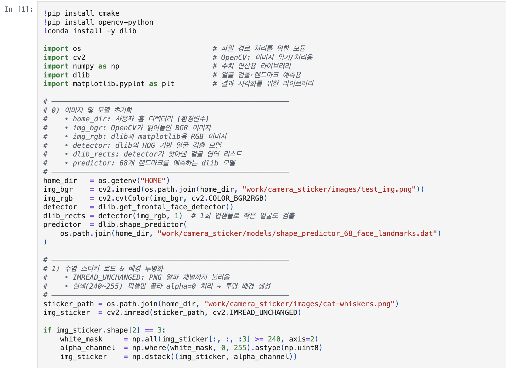
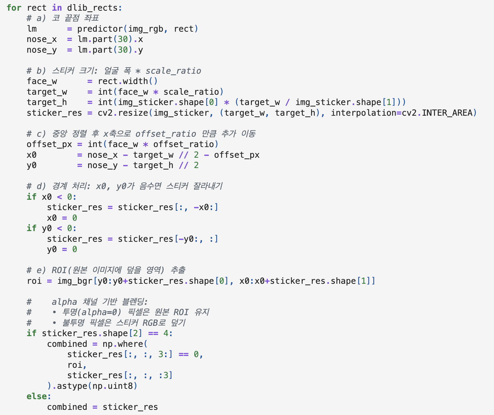
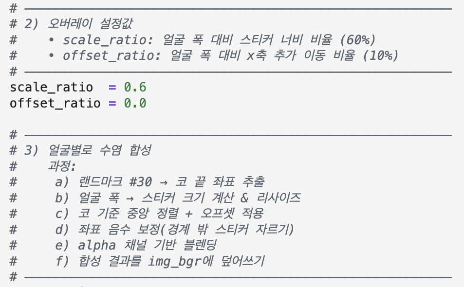
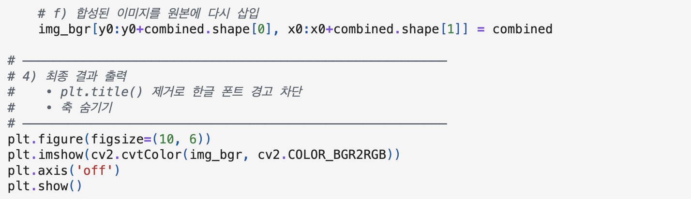
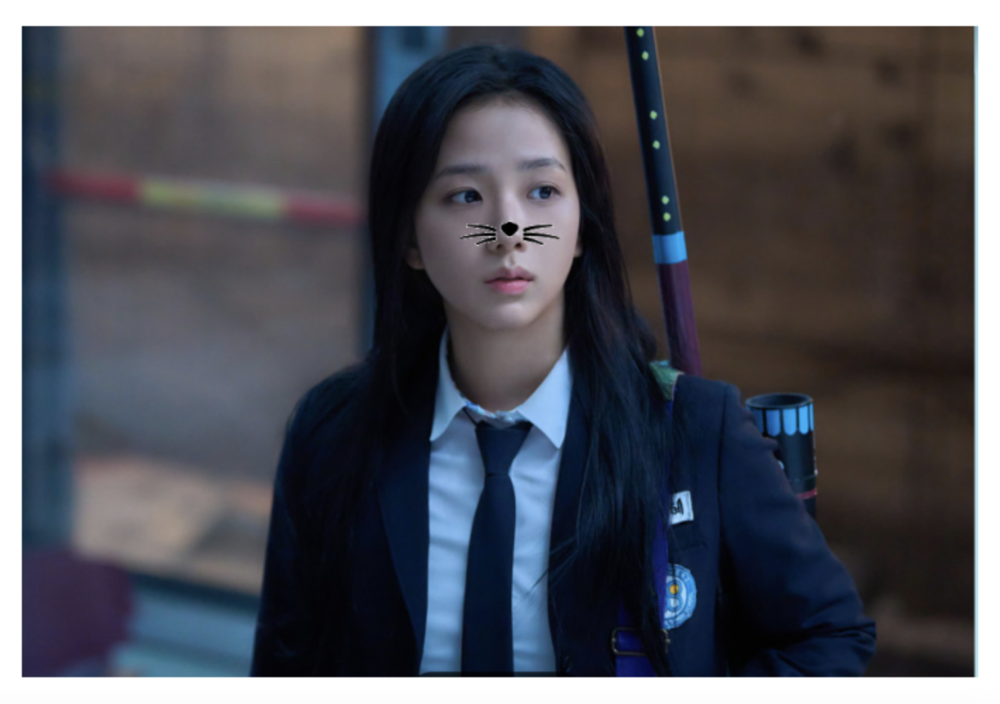

# AIFFEL Campus Online Code Peer Review Templete
- 코더 : 조형순
- 리뷰어 : 이규

# PRT(Peer Review Template)
- [X]  **1. 주어진 문제를 해결하는 완성된 코드가 제출되었나요?**
    - 문제에서 요구하는 최종 결과물이 첨부되었는지 확인
        - 중요! 해당 조건을 만족하는 부분을 캡쳐해 근거로 첨부

문제에서 요구하는 자기만의 카메라앱 기능 구현을 완수하셨고 스티커 이미지를 정확한 원본 위치에 반영하셨습니다.
    
- [X]  **2. 전체 코드에서 가장 핵심적이거나 가장 복잡하고 이해하기 어려운 부분에 작성된 
주석 또는 doc string을 보고 해당 코드가 잘 이해되었나요?**
    - 해당 코드 블럭을 왜 핵심적이라고 생각하는지 확인
    - 해당 코드 블럭에 doc string/annotation이 달려 있는지 확인
    - 해당 코드의 기능, 존재 이유, 작동 원리 등을 기술했는지 확인
    - 주석을 보고 코드 이해가 잘 되었는지 확인
        - 중요! 잘 작성되었다고 생각되는 부분을 캡쳐해 근거로 첨부

문제에서 가장 중요한 바운딩 박스를 잡고 랜드마크를 잘 잡아서 원하는 위치에 스티커를 붙이는 부분이 잘 되어있습니다.
특히 알파채널을 추가해서 스티커를 자연스럽게 잘 붙이신 과정이 좋았습니다.
        
- [X]  **3. 에러가 난 부분을 디버깅하여 문제를 해결한 기록을 남겼거나
새로운 시도 또는 추가 실험을 수행해봤나요?**
    - 문제 원인 및 해결 과정을 잘 기록하였는지 확인
    - 프로젝트 평가 기준에 더해 추가적으로 수행한 나만의 시도, 
    실험이 기록되어 있는지 확인
        - 중요! 잘 작성되었다고 생각되는 부분을 캡쳐해 근거로 첨부

알파채널을 설정 안하고 했을 때 배경이 흰색으로 나와 사진이 부자연스러운 상황이 발생했는데 알파 채널 추가로
그 부분을 해결하셨다고 친절하게 설명해주셨습니다.
        
- [X]  **4. 회고를 잘 작성했나요?**
    - 주어진 문제를 해결하는 완성된 코드 내지 프로젝트 결과물에 대해
    배운점과 아쉬운점, 느낀점 등이 기록되어 있는지 확인
    - 전체 코드 실행 플로우를 그래프로 그려서 이해를 돕고 있는지 확인
        - 중요! 잘 작성되었다고 생각되는 부분을 캡쳐해 근거로 첨부

회고도 잘 작성하셨습니다. 다양한 이미지를 활용하지 못한 점이 아쉽다고 하셨습니다.
        
- [X]  **5. 코드가 간결하고 효율적인가요?**
    - 파이썬 스타일 가이드 (PEP8) 를 준수하였는지 확인
    - 코드 중복을 최소화하고 범용적으로 사용할 수 있도록 함수화/모듈화했는지 확인
        - 중요! 잘 작성되었다고 생각되는 부분을 캡쳐해 근거로 첨부

코드 간략하게 잘 작성하셨습니다. 가독성이 너무 좋았습니다. 전체 코드 이미지라서 이부분에서는 따로 이미지가 없는 점 양해 부탁드립니다.

# 회고(참고 링크 및 코드 개선)

프로젝트 노드를 보고 충실하게 코드를 잘 작성하셨습니다. 제가 코드를 저만 알아볼 수 있게 작성하는 경우가 많은데 다음 프로젝트 노드에서는
좀 더 깔끔하고 모든 사람들이 알아 볼 수 있게 코드를 작성해야겠다는 생각이 들었습니다. 형순님께서 코드 정말 알아보기 쉽게 잘 작성해주셔서 
그렇게 더 느낀거 같습니다. 형순님께서 지수 사진을 활용해서 스티커 붙이기를 진행하셨는데 다음에는 더 다양한 이미지를 활용해서 진행해보시면 
dlib가 어떤 점에서 아쉬움이 생기는지 더 직관적으로 확인하실 수 있을거 같습니다. 정말 고생많으셨고 많이 배웠습니다!
